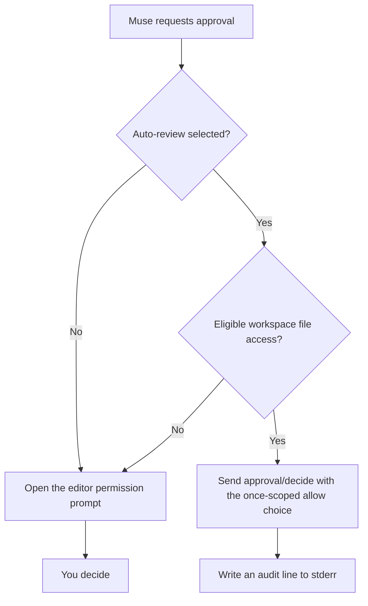

## Background

`muse serve`/MSP exposes only the closed `ApprovalMode` enum
(`allowAll|promptUnmatched|onRequest|denyUnmatched`); there is no
reviewer/profile knob, and saved `:auto-review` sessions fail under `serve`
with `approvalReviewerUnavailable`, which this adapter handles by substituting
`:ask-me` (`src/host_config.rs`). The only low-friction option today is
`allowAll`, which skips review entirely instead of judging each request.

## Proposal

Add an opt-in, default-off, **client-side** auto-review exposed as a
per-session ACP `configOptions` selector. There is no environment variable and
no host change.

Auto-review is **not** an `ApprovalMode` and is **not** appended to the
approval-mode/permissions selector. That selector stays a faithful mirror of
the host's closed enum, which the host can change underneath the adapter via
`session/setApprovalMode` and `session/approvalModeChanged`.

- Selector: `auto_review`, with values `off` (default) and `workspace`.
- When `workspace` is selected, the adapter answers eligible
  `approval/requested` (and reissued `approval/request` / `approval/updated`)
  requests itself: it sends `approval/decide` with the first approving choice
  whose scope is `once`, and never opens `session/request_permission` for that
  request.
- Everything else still opens the normal editor prompt. The fallback is the
  human, never a silent denial and never a silent approval.
- The adapter never changes the host approval mode, never sends the selector
  value to the host, and never honors `MUSE_ALLOW_UNSCOPED_READS` inside the
  eligibility check.
- The selector is dormant under `allowAll`/`denyUnmatched`, where no approvals
  reach the adapter, and effective under `promptUnmatched`/`onRequest`.
- `MUSE_APPROVAL_MODE` is unchanged; it remains the operator's start posture.

## How it works

Eligibility is deliberately narrow for the first cut:

- `subject.kind == "fileAccess"`, `subject.path` is absolute and resolves
  inside one of the session's approved roots. Canonicalization is mandatory:
  an existing path must resolve inside a root, and a not-yet-created path must
  have a canonical parent inside a root. `subject.target`, when present, must
  also resolve inside a root.
- `judgeEscalated` is false or absent.
- `protectedWrite` is false or absent.
- No `subagentOrigin`; child approvals still prompt in the first cut.
- At least one approving choice with `scope == "once"` exists. Session and
  local-persistent grants are never selected silently.

Everything else — shell/process, network, Unix sockets, tool or unknown
subjects, relative or missing paths, unresolvable paths, symlinks that escape
the roots, durable-only choices, malformed params — prompts exactly as today.
Multi-stage approvals are re-evaluated at each requirement; a stage that is
not eligible prompts for that stage.

Each auto-decision writes one stderr audit line naming the approval id, the
tool, the subject kind, and the chosen once-scoped choice.

## Why this is a headline feature

Muse's own `:auto-review` profile does not work under `muse serve`, so
everyone using Muse through an editor currently chooses between clicking
through every workspace edit or switching to `allowAll` and giving up review
entirely. Session-scoped auto-review gives editor users the middle path: the
routine, workspace-local work stops interrupting them, while shell commands,
network access, protected files, and anything outside the approved roots keep
stopping for a human. It is visible, per-session, default-off, and auditable,
and it does not change what Muse itself enforces.

## Documentation requirements

This feature ships with documentation, not after it:

- `README.md` gets a prominent Auto-review section near the top with a short
  marketing blurb, a plain-language explanation of what it does, the
  eligibility boundary, and a Mermaid flow diagram.
- `docs/auto-review.md` is the detailed human guide, linked from the README:
  how it works, eligibility, what still prompts, fail-closed behavior, audit
  output, limitations, and how it differs from Codex auto-review (a reviewer
  agent that replaces prompts and fails closed) and from Muse's TUI-only
  `:auto-review` profile.
- `CHANGELOG.md` records the feature under Unreleased.
- `CONTRIBUTING.md`'s permission-path regression expectation is satisfied with
  tests for eligible and ineligible subjects, off-by-default behavior, the
  durable-choice case, and the prompt fallback.

## Prior art

- Codex `approvals_reviewer = "auto_review"`: routes eligible boundary-crossing
  approvals to a separate reviewer agent instead of the user, fails closed on
  reviewer failure, and offers a one-retry `/approve` override for denials.
  This proposal is deterministic client policy with a prompt fallback, not an
  AI judgment.
- muse-desktop "Approve on my behalf": `onRequest`/`promptUnmatched` plus
  client-side auto-decide of workspace-local scopes.
- buzz-acp: auto-approves every `session/request_permission` with
  `allow_once`.
- bex-co/muse-code-acp: only offers allow-always when the host lists it.

## Acceptance criteria

- A client can select `auto_review=workspace` on a live session; `off` is the
  default and every new, loaded, resumed, or forked session starts off.
- A workspace-local file-access approval is decided without
  `session/request_permission`; the host receives `approval/decide` with the
  once-scoped approving choice, and stderr carries the audit line.
- Shell, network, out-of-workspace, protected-write, judge-escalated,
  subagent-origin, and durable-only-choice cases still prompt, with
  regression coverage.
- The approval-mode selector, MSP wire vocabulary, and `MUSE_APPROVAL_MODE`
  are unchanged.
- README, `docs/auto-review.md`, and CHANGELOG are updated in the same change.

## Delivery plan

1. Add the `auto_review` session selector (`off|workspace`), default off,
   threaded through ACP v1/v2 `configOptions` and `session/set_config_option`
   with no host call.
2. Add strict eligibility and once-scoped choice selection, with unit coverage
   for inside/outside roots, creates, symlink escapes, non-`fileAccess`
   subjects, protected and judge-escalated requests, child approvals, and
   durable-only choices.
3. Answer eligible approvals in the single `open_approval` funnel, with the
   stderr audit line and the prompt fallback, plus fake-host regression tests
   for both protocol versions.
4. Ship the README headline section with the Mermaid diagram,
   `docs/auto-review.md`, and the CHANGELOG entry in the same change.
5. Follow-ups after the first release: subagent-origin approvals, a read-only
   selector variant, and a live-host scenario against a real Muse build.

## Open questions

- Whether a later version should allow subagent approvals whose scopes are
  workspace-local.
- Whether the selector should grow a read-only variant (`workspace-read`) or
  finer action scopes beyond `workspace`.
- Whether persistent grants should ever be auto-selected. The current answer
  is no.
