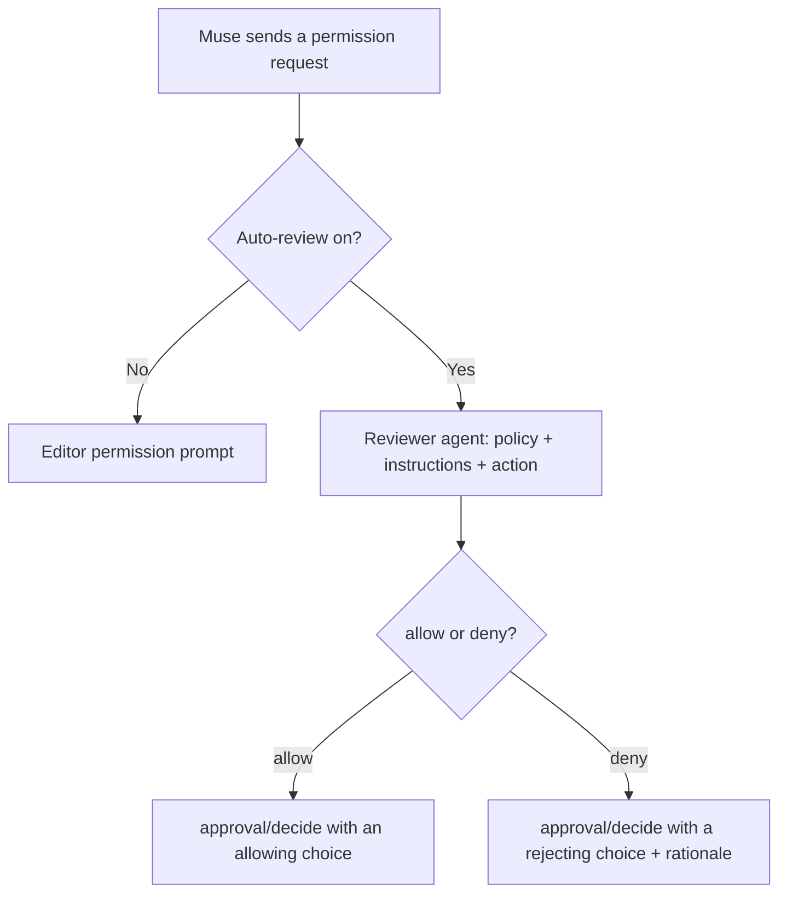

# muse-acp

**Use your existing Muse Code subscription in Zed, JetBrains IDEs, and any other
ACP client.**

[](https://github.com/BrokkAi/muse-acp/actions/workflows/ci.yml)
[](https://github.com/BrokkAi/muse-acp/releases/latest)
[](LICENSE)
[](https://www.rust-lang.org/)

`muse-acp` is a bridge between editors that speak the
[Agent Client Protocol](https://agentclientprotocol.com/) (ACP) and
[Muse Code](https://dev.meta.ai/docs/muse-code). It talks to Muse over its
native [Muse Session Protocol](https://github.com/meta-models/muse-code-sdk)
(MSP), so your subscription keeps Muse's own session engine, tools,
authentication, and approval flow.

The adapter is one small Rust binary with no runtime dependencies. It supports
ACP v1 and v2, and installs on macOS, Linux, and Windows.

> `muse-acp` is an independent community project. Muse Code and Muse Spark are
> products of Meta Platforms, Inc. This project is not affiliated with,
> endorsed by, or supported by Meta.

## Auto-review: let an agent decide every prompt

Muse Code's own `:auto-review` permission profile is a TUI feature. Under
`muse serve`, a saved `:auto-review` session falls back to asking you for
everything, so editor users choose between clicking through every prompt or
switching to `allowAll` and giving up review entirely. `muse-acp` gives you
the middle path: a per-session **Auto-review** selector that sends every
permission request to a reviewer agent instead of to you.

The reviewer is a second Muse model session on its own memory-only, read-only
host (`--no-session-log`), so reviews are never saved and never touch your
files. It gets the same kind of input Codex's guardian gets: a fixed safety
policy, your trusted instructions, recent evidence, and the exact approval
request. It answers with strict JSON - `risk_level`, `user_authorization`,
`outcome`, and a rationale. Low and medium risk actions proceed; critical
risk is denied; high risk proceeds only when your instructions authorize it.
A reviewer failure or an unusable answer denies the action rather than
letting it run. Every decision is logged to stderr with its rationale.



Auto-review is off by default. Select **On** in the **Auto-review**
selector, next to Approval Mode in clients that render ACP `configOptions`,
and it applies to that session only. See the
[Auto-review guide](docs/auto-review.md) for the policy, the reviewer's
inputs, the decision thresholds, and the failure behavior.

## Requirements

- **Muse Code** installed, authenticated, and available as `muse` on `PATH`.
- A **stdio ACP client**: Zed, a JetBrains IDE with AI Assistant, or another
  ACP client such as [micro-acp](https://github.com/BrokkAi/micro-acp).
- **Node.js 22+** if you install from npm.
- **Rust 1.88+** if you build from source.

## Quick start

### 1. Install Muse Code

Install Muse and log in before installing the adapter:

```sh
curl -fsSL https://dev.meta.ai/install.sh | sh
muse login
```

On macOS you can also use Homebrew:

```sh
brew install --cask muse-code
```

Confirm `muse --version` works, then continue.

### 2. Install muse-acp

With Node.js 22 or later, install from npm:

```sh
npm install -g @brokkai/muse-acp
muse-acp --selftest
```

Or run it without a global install:

```sh
npx --yes @brokkai/muse-acp --selftest
```

The npm package bundles the native binaries for every supported platform, so it
needs no install scripts or separate downloads.

> The package is the scoped `@brokkai/muse-acp`. The unscoped `muse-acp`
> package on npm is a different, unrelated project, so `npm install -g
> muse-acp` installs someone else's adapter.

On Linux and macOS you can install the latest release instead:

```sh
curl --proto '=https' --tlsv1.2 -LsSf \
  https://github.com/BrokkAi/muse-acp/releases/latest/download/install.sh | sh
```

The installer detects your platform, verifies the archive's SHA-256 checksum,
and installs `muse-acp` to `~/.local/bin`. Pin a version or choose another
absolute destination with environment variables on `sh`:

```sh
curl --proto '=https' --tlsv1.2 -LsSf \
  https://github.com/BrokkAi/muse-acp/releases/latest/download/install.sh \
  | MUSE_ACP_INSTALL_DIR="$HOME/bin" MUSE_ACP_VERSION=vX.Y.Z sh
```

On Windows x86_64 or arm64, run the PowerShell installer for the MSVC release:

```powershell
irm https://github.com/BrokkAi/muse-acp/releases/latest/download/install.ps1 | iex
```

It picks the build for the machine's architecture, even from an emulated x64
PowerShell on arm64, verifies the ZIP's SHA-256 checksum, and installs
`muse-acp.exe` to `$env:LOCALAPPDATA\Programs\muse-acp`, leaving `PATH`
untouched. Set `MUSE_ACP_VERSION` or `MUSE_ACP_INSTALL_DIR` to pin a version or
choose another absolute directory, then add the reported directory to your user
`PATH`.

From a checkout, build and install with Cargo:

```sh
cargo install --path .
```

### 3. Connect your editor

```sh
muse-acp install            # Zed
muse-acp install-intellij   # IntelliJ IDEA and other JetBrains IDEs
```

Both commands are safe to re-run: they preserve existing agent entries, write a
`.bak` backup, and replace the settings file atomically. Use `--dry-run` to
preview an edit.

Any other ACP client can launch `muse-acp` directly over stdio.

## Editor setup

### Zed

`muse-acp install` registers the adapter in Zed's settings file,
`~/.config/zed/settings.json` (`%APPDATA%\Zed\settings.json` on Windows):

```json
{
  "agent_servers": {
    "muse-acp": {
      "type": "custom",
      "command": "muse-acp",
      "args": [],
      "env": {}
    }
  }
}
```

On Windows it records the full path to the running `muse-acp.exe` instead,
because the PowerShell installer leaves `PATH` untouched.

### JetBrains IDEs

`muse-acp install-intellij` writes `~/.jetbrains/acp.json`, recording the full
path to the running binary as JetBrains requires:

```json
{
  "agent_servers": {
    "muse-acp": {
      "command": "/Users/you/.local/bin/muse-acp",
      "args": [],
      "env": {}
    }
  }
}
```

Then open AI Chat and select `muse-acp`.

### Installer options

`install` and `install-intellij` accept:

```sh
muse-acp install --command /absolute/path/to/muse-acp
muse-acp install --env MUSE_CLI=/absolute/path/to/muse
muse-acp install --settings /path/to/settings.json --dry-run
muse-acp uninstall
muse-acp uninstall-intellij
```

Run `muse-acp help` for the full option list.

## Configuration

The adapter reads its settings from the environment. Export them in your shell,
or set them in the client's agent entry so the editor passes them to the
adapter.

Auto-review is the exception: it is a per-session selector, not an environment
variable. See [Auto-review](#auto-review-keep-the-boundary-lose-the-busywork).

| Variable | Default | Purpose |
| --- | --- | --- |
| `MUSE_CLI` | `muse` | Muse host binary to launch. Use an absolute path when the editor's `PATH` differs from your shell's. On Windows the default also finds the `muse.cmd` launcher that the Muse installer puts on `PATH`. When `PATH` has no `muse`, the default falls back to the Muse installer's location (`MUSE_INSTALL_DIR`, else `~/.local/bin`, or `%LOCALAPPDATA%\Programs\muse` on Windows). |
| `MUSE_SERVE_ARGS` | none | Extra host-lifetime flags for `muse serve` (see `muse serve --help`). Split on whitespace; no shell quoting or expansion. |
| `MUSE_APPROVAL_MODE` | host default | Force an approval posture: `allowAll`, `promptUnmatched`, `onRequest`, or `denyUnmatched`. `promptUnmatched` sends every unmatched tool call through `session/request_permission`. |
| `MUSE_COMMAND_TIMEOUT_MS` | method-specific | Override the host admission-ack deadline, in milliseconds. |
| `MUSE_SHUTDOWN_TIMEOUT_MS` | `8000` | Shutdown deadline, 100–60000 ms. |
| `MUSE_TOOL_OUTPUT_LIMIT` | `8000` | Editor-facing tool output bound, in characters (minimum 200). |
| `MUSE_LOG` | `normal` | Set to `debug` for per-method protocol tracing (no payloads). |
| `MUSE_ALLOW_UNSCOPED_READS` | off | **Dangerous.** Set to `1`, `true`, `yes`, or `on` to allow local reads outside the approved workspace roots. |

Without `MUSE_COMMAND_TIMEOUT_MS`, admission deadlines are 30 seconds for the
handshake, queries, and approval or input decisions; 180 seconds for session
start, resume, and read and for view paging; and 60 seconds for other methods.
These bound how long the adapter waits for a command response, not how long a
model turn may run.

### Read-only and plan modes

The editor's **Mode** selector chooses what Muse may change in a session:

- **Default** — Muse edits files and runs commands as the approval mode
  allows.
- **Read-only** — Muse can read, search, and answer, but cannot write files
  or run shell commands.
- **Plan** — read-only, and each turn tells Muse to investigate and propose a
  plan instead of implementing it. Only changing the mode leaves Plan. A bare
  `/plan` switches to Plan without starting a turn; `/plan <text>` still runs
  Muse's plan skill in the current mode.

Read-only and Plan are enforced by Muse, not by the adapter: those sessions
run on a second `muse serve` that `muse-acp` starts with `--disable-write
--disable-shell` the first time it is needed. Through Muse 1.4.2, Muse
answers a write with "tool policy denied filesystem write"; from 1.4.3 it
does not offer write or shell tools in those sessions at all. MCP tools are
not covered by those flags; their calls still go through approvals.

Muse lets only one host hold a session, and releases it only when that host
exits. Changing the mode of an open session therefore restarts the host that
holds it, and every other session on that host reconnects by itself. The
change is refused while anything runs on that host, in this thread or
another: a turn, a background tool, a subagent, or a workflow. Try again when
it finishes.

The adapter remembers each session's mode in
`$XDG_STATE_HOME/muse-acp/session-modes.json` (Windows:
`%LOCALAPPDATA%\muse-acp\session-modes.json`), so a session you load or
resume later comes back in the same mode. A fork keeps its source's mode.

The approval policy has its own **Approval Mode** selector (`approval_mode`).
Clients that still send an approval mode such as `promptUnmatched` to the
`mode` selector, or to `session/set_mode`, keep setting the approval mode.

### Approval-profile compatibility

If Muse is saved with the `:auto-review` permission profile, `muse serve`
cannot start its automated reviewer. The adapter gives its own `muse serve`
child a private, temporary settings view that uses `:ask-me`, so approvals come
to your editor. Your saved Muse settings, editor launcher, and session data are
left untouched, and the temporary view is removed when the host exits. Other
permission profiles are passed through unchanged.

The view links the rest of your configuration instead of copying it, so
credentials are never copied. Files Muse creates while it runs, such as the
credential from your first login or your first workspace trust, are written
to your real configuration too. On Windows it needs neither Developer Mode nor
administrator rights: folders are linked with directory junctions, and files
with symbolic links when Windows allows them, otherwise with hard links. When
Muse replaces a hard-linked file, such as a refreshed `auth.json`, or creates
a new one, the adapter moves the new file to your configuration when the host
exits, unless your configuration also changed in the meantime. If the editor
stops the agent before it can, the next launch finishes the job. With hard
links, a login you complete in a terminal while the agent runs reaches
`muse serve` with your next prompt or new session, or when the editor
authenticates after **Log in with Muse**. If the view cannot
be built, for example because the temporary folder is on a different drive
from your configuration, `muse serve` starts with your saved settings, and the
error the editor shows if Muse then refuses the profile says why.

## What's supported

- **Sessions** — new, load, resume, list, close, and fork, with durable Muse
  session IDs that survive adapter and host restarts. Delete is available on
  Muse 1.4.1 and 1.4.2 with durable session logs; Muse 1.4.3 no longer
  serves it, so the adapter does not offer it there. Muse deletes only
  sessions it can prove the running host owns, so a session from an earlier
  editor run is kept and the editor is told why instead of being pretended.
  Deleting a session that never existed succeeds silently when Muse's
  listing filters can prove the absence (1.4.2); without them the refusal is
  reported.
- **Turns** — streamed text and tool updates, queued concurrent prompts,
  cancellation with a terminal event, and exact-turn steering over the ACP v2
  `_session/steering` extension.
- **Approvals** — Muse approval requests surfaced as
  `session/request_permission`, with a deny-safe fallback, plus optional
  [Auto-review](#auto-review-keep-the-boundary-lose-the-busywork) for
  workspace-local file access.
- **MCP servers** — stdio and HTTP MCP servers attached by the editor load
  into the Muse session on Muse 1.3.0 and newer; see
  [Client-provided MCP servers](#client-provided-mcp-servers).
- **Questions** — Muse `userInput/requested` bridged to ACP
  `elicitation/create` forms when the client advertises form support; otherwise
  the host falls back to auto-cancel.
- **Modes** — Default, Read-only, and Plan, where Muse itself refuses file
  writes and shell commands; see [Read-only and plan modes](#read-only-and-plan-modes).
- **Configuration** — mode, approval mode, auto-review, model, and reasoning
  effort exposed as ACP `configOptions` selectors, refreshed from Muse on
  create, load, resume, and config change. The reasoning selector starts at
  `Muse default` and sends no override until you pick a tier; on Muse 1.4.1+
  it offers exactly the tiers the selected model serves, with Muse's own
  descriptions, and follows a model change.
- **Skills** — Muse's skill catalog drives ACP `available_commands_update`.
  Slash prompts such as `/plan` use native skill turn parts; `/compact` invokes
  Muse's native compaction.
- **Goals** — `/goal <objective>` sets the session goal, `/goal edit
  <objective>` replaces it, and `/goal pause`, `/goal resume`, `/goal clear`
  manage it, mapping onto the host `goal/*` methods. When a command starts a
  goal turn, the prompt stays open until that turn ends, and Stop interrupts
  it (Muse then pauses the goal). Stop also reaches goal turns Muse starts on
  its own. Objectives may include @-mentions. Goal state still streams back
  through `session/goalChanged` display metadata.
- **Session names** — `/rename <name>` renames the session through the host's
  `session/rename`; the new title arrives through `session/nameChanged` as an
  ACP `session_info_update`.
- **Workflow children** — workflow cards list each child with its id, and
  `/workflow-child skip <childId>` or `/workflow-child retry <childId>` controls
  one child of a running workflow through the host's `workflow/childControl`.
  A bare `/workflow-child` lists the children you can control.
- **Content** — text, inline and local-file images, `resource_link` text
  expansion, and embedded context. Audio is rejected, because Muse's input type
  is closed to `text` and `image`.
- **Usage** — context occupancy as `usage_update`, cumulative session totals,
  subscription observations under `_meta.museSubscriptionUsage`, and a
  session cost that on Muse 1.4.2+ is Muse's own figure (with its partial
  flag) and otherwise is a client-local list-price estimate explicitly
  labeled as not a billing figure.
- **Feedback** — `/feedback [bug|bad|good|other] <note>` sends feedback about
  Muse through the host's `feedback/submit` when Muse grants the capability.
  With form elicitation, one form collects the classification, the note, and
  explicit consent for each attachment (local tracing, the session record),
  both defaulting off.
- **Tasks and subagents** — backgrounded shell commands, workflows, and native
  subagents surfaced through negotiated ACP extensions where the client
  advertises support, with synthesized tool cards otherwise.
- **File changes** — per-turn workspace file-change reports from the host's
  native file tools when the client negotiates the AIR extension.
- **Stored output** — bounded tool output with head and tail retained, plus
  opt-in `_session/readOutput` access to the host's stored bytes.

### Protocol extensions

Beyond core ACP, the adapter negotiates these extensions. Each activates
only when the client opts in too, with the documented fallback otherwise:

- `_session/steering` (ACP v2 only) — exact-turn steering; rejected with
  `-32601` on v1. Follows the ecosystem `_session/steering` convention
  (`steering.supported`); the standards-track `session/inject` proposal is
  still unmerged — adopting it is future work.
- `_session/readOutput` — opt-in reads of host-stored tool output.
- `_session/userShell` — shell commands outside any turn; needs editor
  opt-in, AIR `asyncTasks`, and a host grant all together.
- `_session/async_task/stop` — stop one background task; `session/cancel`
  maps background work to `task/stopAll`.
- JetBrains AIR v1 (`agentFileChangeReport`, `nativeSubagentSessions`,
  `asyncTasks`, `recommendedValue`) — per-turn file-change reports, native
  subagent sessions, async-task observation and stops, model and reasoning
  recommendations.

The [MSP event compatibility matrix](docs/event-compatibility.md) records the
ACP mapping or intentional disposition of every notification in the pinned
schema. [ROADMAP.md](ROADMAP.md) tracks compatibility, reliability, and release
priorities.

### Client-provided MCP servers

MCP servers that your editor attaches to a session become tools in that Muse
session. This includes Zed's context servers and the IDE server JetBrains
passes. It needs Muse 1.3.0 or newer: the adapter requests the host's
`sessionMcp` capability and loads the servers through `session/start` and
`session/resume` configuration.

- **Transports** — stdio servers and HTTP (streamable HTTP) servers. The
  adapter advertises HTTP support (`mcpCapabilities.http` in ACP v1,
  `session.mcp` in ACP v2) only when the host granted `sessionMcp`. SSE
  servers are not supported by Muse and are dropped with a log line.
- **Failures** — every server is loaded as optional. A server that cannot
  start is skipped, and the session keeps working without its tools. An
  invalid entry (for example, one with no command) is dropped with a log line
  and does not fail the session.
- **Approvals** — the model sees each tool as `mcp__<server>__<tool>`, and
  every call goes through Muse's normal approval flow. Muse's "Always allow
  this MCP tool" choice saves a persistent rule for that server and tool name.
  It applies to any later server with the same name, including one configured
  in Muse itself.
- **Reloading** — Muse fixes a session's MCP servers when it loads the
  session, and it does not save them. Loading a session again re-sends the
  editor's current servers. If the adapter's Muse host already has the session
  loaded with a different set, for example after you close a thread, change
  context servers, and reopen it, the session keeps its current servers until
  muse-acp restarts. A restarted Muse host gets the servers again
  automatically.
- **Forks** — a forked session starts without the editor's MCP servers,
  because Muse's fork takes no configuration. It gets them the next time Muse
  loads it.
- **Older Muse hosts** — without the `sessionMcp` grant, the servers are
  dropped and the adapter logs `ignoring client-provided MCP servers: this
  Muse host did not grant sessionMcp`. Configure MCP servers in Muse itself
  instead.

The adapter log names forwarded and dropped servers but never prints their
commands, arguments, URLs, environment values, or headers.

## How it compares

Several independent projects bridge Muse Code to ACP. They broadly split into
two designs: adapters that speak Muse's native session protocol over a
long-lived `muse serve`, and bridges that wrap the one-shot `muse exec --json`
event stream. The table below reflects each project's public documentation and
package metadata as of September 2026; check the projects themselves for
current behavior.

| Adapter | Language / runtime | Muse transport | Install | Editor targets | License |
| --- | --- | --- | --- | --- | --- |
| **muse-acp** (this project) | Rust; single native binary, no runtime | MSP over one long-lived `muse serve` | npm `@brokkai/muse-acp`, release installers, `cargo install` | Zed, JetBrains, any stdio ACP client | Apache-2.0 |
| [bex-co/muse-code-acp](https://github.com/bex-co/muse-code-acp) | TypeScript; Node.js 22+ | Muse SDK over `muse serve` | npm `@bex-co/muse-code-acp` | Zed, VS Code, other ACP clients | Apache-2.0 |
| [sanjay3290/muse-acp](https://github.com/sanjay3290/muse-acp) | TypeScript; Node.js 20+ | MSP over `muse serve` | npm `muse-acp` | ACP clients (Zed example) | Apache-2.0 |
| [julianubico/muse-code-acp-bridge](https://github.com/julianubico/muse-code-acp-bridge) | JavaScript; Node.js 22.13+ | `muse exec --json` JSONL | from source (documented npm name not currently published) | acpx custom agents | MIT |
| [einklover/muse-acp-server](https://github.com/einklover/muse-acp-server) | TypeScript; Node.js 22+ | `muse exec --json`, with model traffic proxied through OpenCode credentials | from source | Paseo | MIT |
| [jannotix/muse-acp-agent](https://github.com/jannotix/muse-acp-agent) | TypeScript | Uses Muse Code models as the reasoning core | from source | ACP clients | Apache-2.0 |

The headless `muse exec --json` design is a good fit for one-shot automation and
scripted workflows. This adapter chooses MSP so a single editor session keeps
native streaming, approvals, cancellation, configuration, resume, and usage,
instead of starting a new Muse CLI process for each prompt.

Adjacent projects worth knowing about, though not ACP adapters themselves:
[BrokkAi/mjolnir](https://github.com/BrokkAi/mjolnir) is a Rust control plane
for several ACP coding agents including Muse, and
[agentic-control-plane/muse-code-acp-plugin](https://github.com/agentic-control-plane/muse-code-acp-plugin)
is a Muse plugin that policy-checks tool calls.

## How it works

One `muse serve` child serves all ACP sessions for the adapter's lifetime.
`session/new` starts a host session in the requested `cwd`; `session/start`
auto-subscribes the adapter to the session view so turns stream in as `item/*`
and `turn/*` notifications. The adapter folds those into ACP `session/update`
messages:

| Muse (MSP) | Editor (ACP) |
| --- | --- |
| `session/start`, turns, and history | `session/new`, `session/prompt`, `session/load`, `session/resume`, `session/fork` |
| `item/delta` message text | `agent_message_chunk` |
| `toolCall` items | `tool_call` and `tool_call_update` |
| `turn/completed` | v1 prompt response with stop reason and usage; v2 `state_update` |
| `approval/requested` | `session/request_permission`, answered with `approval/decide`; eligible requests can be answered directly by Auto-review |
| `userInput/requested` | `elicitation/create` form |
| `model/list`, `session/setModel`, `session/setApprovalMode`, `session/setReasoningEffort` | `configOptions` selectors and `session/set_config_option` |
| `skill/list`, `skill/changed` | `available_commands_update` |
| `session/contextUsage`, `session/tokenUsage` | `usage_update` |
| `turn/steer` | `_session/steering` (ACP v2) |
| Forks, subagents, async tasks, user shell, stored output | negotiated ACP extensions |

Muse's stable schema is the authority for MSP shapes (`muse schema
generate-json-schema`). A schema fingerprint mismatch with the vendored bundle
is logged, not fatal.

## Workspace and file access

ACP's `cwd` is the primary workspace root and the base for relative resource
paths; the adapter passes it to Muse as MSP's single `workspaceRoot`. If a
client sends `additionalDirectories`, each must be absolute and name an
existing directory, and the adapter treats
`[cwd, ...additionalDirectories]` as the ordered set of roots approved for
local image and textual `resource_link` expansion. On Muse 1.4.1+ the same
canonical set is sent to the host as MSP `workspaceRoots`, so Muse's own tools
work in the extra folders too, with duplicates collapsed and no root silently
dropped. Older hosts keep adapter-side confinement only, and the adapter logs
that Muse's own tools see just the primary root.

Local reads are confined to that root set. The adapter resolves each path and
root through the filesystem before checking containment, so `..`,
percent-encoded separators, case differences, and symlinks cannot escape the
approved roots. Only valid UTF-8 text without binary control bytes is expanded,
up to 256 KiB per resource; malformed `file://` escapes and remote hosts are
rejected. Setting `MUSE_ALLOW_UNSCOPED_READS` disables this boundary and should
not be used with untrusted sessions.

## Authentication and remote environments

When Muse has no credential, `session/new` and `session/load` fail with ACP's
`-32000` authentication-required error, so editors such as Zed open their login
screen before the first prompt. The adapter learns this from Muse's
`account/read`, which reports only which kind of credential is in effect. That
method is experimental, so the adapter opts into Muse's experimental API. If
the check is unavailable, the first prompt reports the same error instead. A
credential that expires later also yields `-32000` with login guidance.
Editors that support ACP terminal auth then offer the
adapter's `muse-login` method. It runs `muse-acp login` in a terminal, which
runs `muse login` with the executable selected by `MUSE_CLI`, so you can
approve the device code in your browser. You can also run either command
yourself, then restart the editor agent.

```sh
muse-acp login                   # or: npx --yes @brokkai/muse-acp login
```

`META_API_KEY`, when set in the agent's environment, takes priority over the
account login.

If `muse serve` cannot start at all, the adapter still completes the ACP
handshake. Every later request then returns the startup diagnostic, so the
editor shows what to fix.

If Muse is not installed, requests fail with the same `-32000` error, and the
auth method is named **Set up Muse Code**. `muse-acp login` then
shows the official Muse installer command (`curl -fsSL
https://dev.meta.ai/install.sh | bash`, or `irm https://dev.meta.ai/install.ps1
| iex` on Windows) and asks before running it. It installs only on Enter or
`y`, then continues with `muse login`. It never installs when `MUSE_CLI` is
set. Restart the editor agent afterwards if it still reports Muse as missing.
Muse's installer puts `muse` in `~/.local/bin` (`%LOCALAPPDATA%\Programs\muse`
on Windows, or `MUSE_INSTALL_DIR`), and the adapter looks there when `muse` is
not on the editor's `PATH`.

Run the login **where the adapter runs, as the same OS user**. For SSH,
containers, remote IDE backends, or a different OS account, a login on your
desktop does not help; log in on the remote host. The adapter never opens a
browser, never prompts for credentials over ACP stdio, and never copies
credentials between machines. Its only ACP auth method runs Muse's own login
in a terminal, and `account/read` never returns key material, so credentials
stay in the Muse environment.

## Sandbox advisory for Linux arm64

Muse 1.0.2 may fail to start its sandbox on Linux arm64 when a required sandbox
binary is missing. Prefer upgrading Muse or installing the sandbox support.
Only if neither is possible, and only if you accept running host tools without
the sandbox's isolation:

```sh
MUSE_SERVE_ARGS="--trust-workspace --disable-sandbox"
```

`--disable-sandbox` materially reduces isolation, and neither approval prompts
nor this adapter's read confinement replace it. Sandbox posture is fixed for
the life of `muse serve`; re-enable it as soon as the host supports your
platform.

## Diagnostics

```sh
muse-acp --selftest   # static payload + schema compatibility + CLI probe
muse-acp --support    # redacted support bundle, safe to paste into a report
```

`--selftest` validates the adapter's built-in payloads, prints the MSP schema
compatibility table, and reports whether the configured Muse CLI can be invoked
(`cli-ready` or `cli-unready`). It exits `0` even when Muse is not installed, so
you can collect output on a machine that is still being set up.

Set `MUSE_LOG=debug` for per-method protocol tracing. Tracing records method
names and outcomes, not payloads.

When the editor closes the ACP connection, the adapter starts a shutdown
deadline, fails outstanding requests, and exits. If the deadline expires first,
it records a diagnostic and exits nonzero.

## Supported platforms

| OS | Architecture | Notes |
| --- | --- | --- |
| macOS | x86_64, arm64 | Supported |
| Linux | x86_64, arm64 | glibc; see the Linux arm64 sandbox advisory above |
| Windows | x86_64, arm64 | MSVC release |

Linux musl, 32-bit systems, and other operating systems have no published
release target.

## Development

Build and run from a checkout:

```sh
cargo build
./target/debug/muse-acp --selftest
```

Before submitting a change:

```sh
cargo fmt --check
cargo clippy --locked --all-targets -- -D warnings
cargo test --locked
cargo run --locked -- --selftest
node --test npm/test/launcher.test.cjs
python3 -m unittest discover -s scripts -p 'test_*.py'
```

The integration tests use the checked-in fake MSP host at
`tests/fixtures/fake_serve.py`, so they do not require a live Muse session.
See [CONTRIBUTING.md](CONTRIBUTING.md) for the full development workflow and
[RELEASING.md](RELEASING.md) for the release process.

## Security

Report vulnerabilities privately as described in [SECURITY.md](SECURITY.md),
never in a public issue.

## License

Copyright 2026 Brokk.ai. Licensed under the Apache License, Version 2.0. See
[LICENSE](LICENSE) and [NOTICE](NOTICE).
