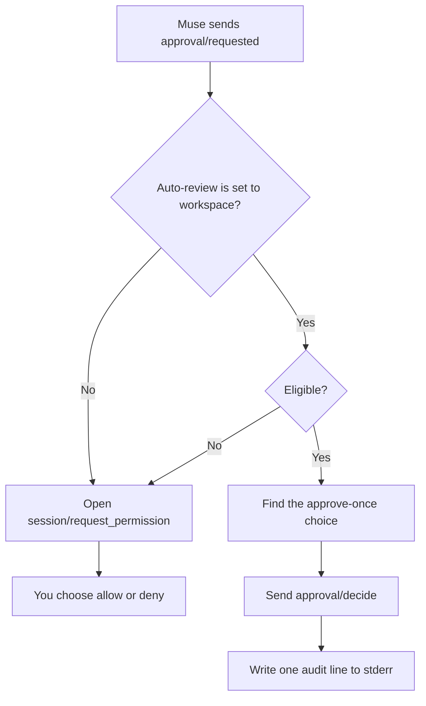

# Auto-review

Auto-review lets `muse-acp` answer routine, workspace-local approval requests
on your behalf while everything else keeps stopping for a human. It is off by
default, scoped to one editor session, and visible as a normal ACP
`configOptions` selector.

This guide explains exactly what it does, what it will never do, and how to
audit it.

## Why it exists

Muse Code ships an `:auto-review` permission profile in its terminal UI. That
profile does not exist under `muse serve`, the host `muse-acp` uses, so a
saved `:auto-review` session cannot be served as-is. Muse's approval modes are
also closed:

- `allowAll` approves everything without review.
- `promptUnmatched` asks about every unmatched action.
- `onRequest` asks when the model requests approval.
- `denyUnmatched` refuses unmatched actions without asking.

None of them means "approve the ordinary edits inside my workspace and ask me
about everything else." Auto-review adds that middle path in the adapter, so
Muse's own sandbox, policy, and approval mode stay exactly as they are.

## How it works

Auto-review runs inside `open_approval`, the single place where every approval
enters the adapter: `approval/requested` notifications, reissued
`approval/request` server requests, and `approval/updated` refreshes. When a
request is eligible, the adapter sends `approval/decide` directly and the
editor never sees a permission dialog for it. When a request is not eligible,
nothing changes: the normal `session/request_permission` flow runs.

Multi-stage approvals are evaluated stage by stage. A stage that is not
eligible prompts for that stage; an eligible stage is answered with a
once-scoped allow.

## Eligibility

An approval is eligible only when every one of these conditions holds.

| Condition | Why |
| --- | --- |
| The subject kind is `fileAccess`. | Shell, process, network, Unix-socket, tool, and unknown subjects can act outside a path-scoped workspace. Unknown kinds are never auto-approved. |
| The subject has an absolute `path` that resolves inside one of the session's approved roots. | The workspace boundary is the whole safety argument. Relative paths, missing paths with missing parents, and paths outside every root are not eligible. |
| If the subject has a `target`, it also resolves inside a root. | Moves and renames can have two path-shaped ends; both must stay inside. |
| `judgeEscalated` is absent or false. | Muse's own judge escalated this request; the adapter does not overrule it. |
| `protectedWrite` is absent or false. | Muse marked this as a protected write. |
| `subagentOrigin` is absent. | First-cut policy: approvals from child agents still prompt on the owner session. |
| At least one allowing choice is scoped to `once`. | Auto-review may approve this action, but it may not create a session or permanent "allow always" rule. |

Path checks canonicalize both the candidate and every root. A symlink that
resolves outside a root is refused. A file that does not exist yet is allowed
only when its parent directory exists and resolves inside a root, which is the
normal case for creating a new file. An entry that exists but cannot be
resolved, such as a dangling symlink, is refused rather than guessed at.

`MUSE_ALLOW_UNSCOPED_READS` does not affect auto-review. That variable widens
read access for resource links; it never widens what auto-review may approve.

## What still prompts

With Auto-review set to **Workspace**, these requests still open the normal
editor permission dialog:

- Shell commands and process executions, including commands that only touch
  the workspace. The adapter cannot prove a shell command stays inside a
  path-scoped boundary.
- Network requests and Unix-socket requests.
- Reads or writes outside every approved workspace root.
- Writes Muse marked `protectedWrite`.
- Requests Muse's judge escalated.
- Approvals from subagents or child sessions.
- Approvals whose only allow choices are scoped to the session or to
  persistent rules.
- Malformed, unknown, or ambiguous subjects.

In every one of these cases the fallback is the human, not a denial. Auto-review
never turns "I am not sure" into "no."

## What gets approved

For an eligible request, the adapter selects the first allowing choice in host
order whose scope is `once` and sends it through `approval/decide`. It never
selects `session` or `localPersistent` choices, even when they are the only
allowing choices available; in that case the request prompts instead.

The host's choices and its rule previews are untouched. Auto-review only
answers the request; the host still records the decision and governs how long
that decision lasts.

## Audit trail

Every automatic decision writes one line to the adapter's stderr log, in this
shape:

    [muse-acp] auto-review approved ap-1 (workspace-files, fileAccess) with c-allow

The line names the approval id, the tool, the subject kind, and the choice the
adapter selected. Setting `MUSE_LOG=debug` adds the adapter's normal per-method
protocol tracing, which is useful when you want to see the surrounding
approval flow without payload contents.

## Interaction with modes

Auto-review is independent of the Approval Mode selector. Selecting
`auto_review=workspace` does not call `session/setApprovalMode`, does not send
anything to the Muse host, and does not change what Muse's sandbox permits.

Because approvals only reach the adapter in modes that surface them,
auto-review is effective under `promptUnmatched` and `onRequest`, and dormant
under `allowAll` and `denyUnmatched`. Dormant is not an error: if the host
approves or denies everything itself, there is nothing for the adapter to
answer.

The selector is also independent of the editor's Mode selector (Default,
Read-only, Plan). In Read-only or Plan sessions, Muse refuses writes and shell
commands at the host, so there is usually nothing auto-review could approve;
turning it on there is harmless.

## Turning it on

In a client that renders ACP `configOptions`, open the session configuration
and set **Auto-review** to **Workspace**. The selector is off for every new,
loaded, resumed, or forked session; the adapter does not persist it. Turning
it off restores the normal prompt flow immediately for later approvals in the
same session.

Enabling or disabling Auto-review never affects an approval that is already
displayed. It applies to the next approval the adapter handles.

## How this differs from other auto-approval designs

**Codex auto-review** routes eligible boundary-crossing approvals to a separate
reviewer agent instead of the user. The reviewer can approve, deny, or fail,
and failures fail closed: the action does not run. This adapter's Auto-review
is not an AI judgment. It is deterministic, path-scoped client policy, and its
fallback for anything uncertain is the editor prompt.

**Muse's TUI `:auto-review` profile** is a host-side permission profile that
`muse serve` cannot use. This adapter keeps rewriting a saved `:auto-review`
profile to `:ask-me` so the host starts, and offers its own per-session
selector instead. Your saved Muse settings are not changed.

**`allowAll`** skips review entirely. Auto-review approves only eligible
workspace-local file access, one action at a time, and keeps the prompt for
everything else.

## Limitations and non-goals

- Auto-review is a convenience boundary, not a security boundary. Muse's
  sandbox, approval mode, and policy remain the enforcement layer.
- It does not approve shell commands, even trusted ones. Use Muse approval
  rules or `allowAll` if you want that posture; the adapter will not infer it.
- It does not select persistent grants, so repeated identical actions are
  approved once each time the host asks.
- It does not cover child-agent approvals in the first release.
- It does not persist across sessions. A client that wants a standing
  preference can select the option after each `session/new`, `session/load`,
  `session/resume`, or `session/fork`.
- It only exists in clients that render ACP `configOptions`. Clients that do
  not are unaffected and keep the normal prompt flow.
